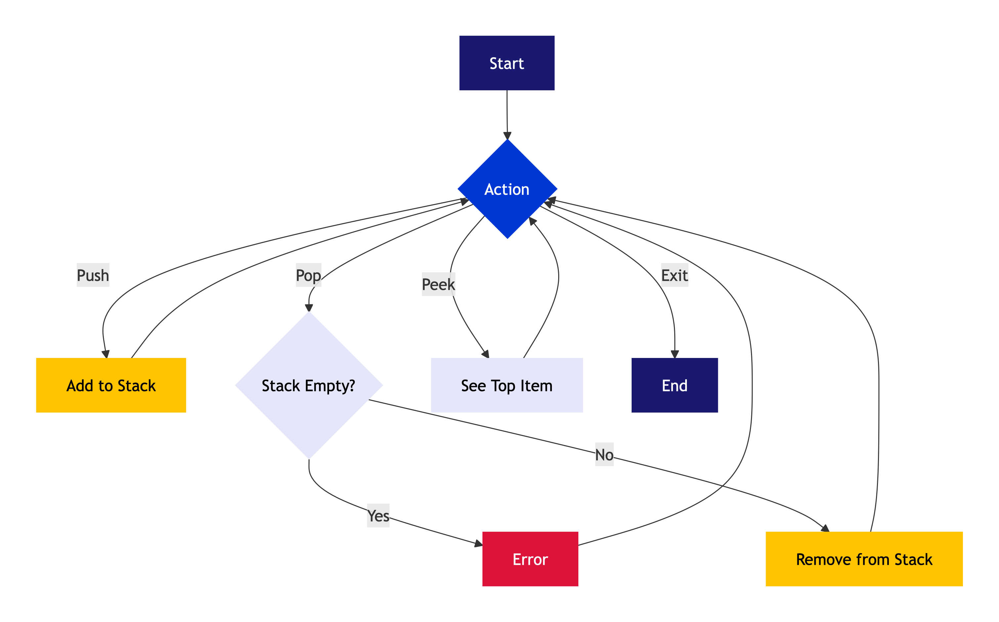
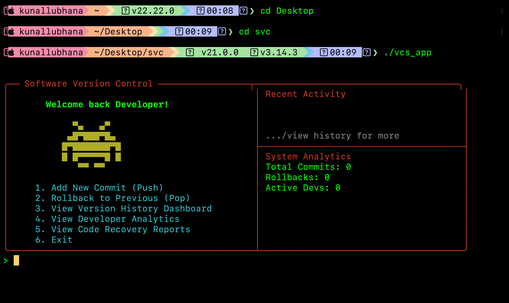
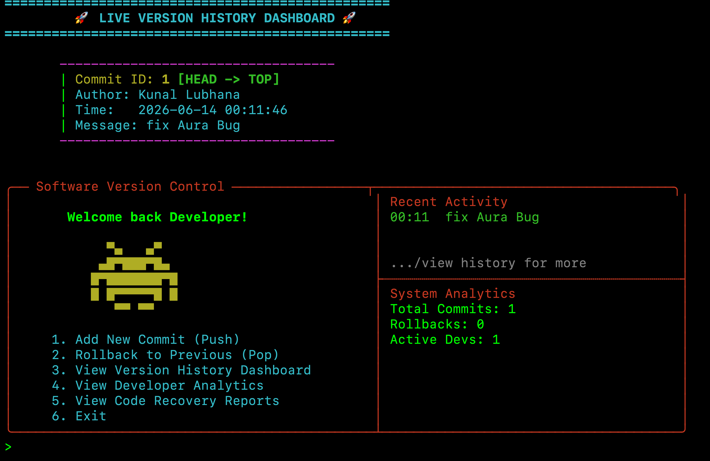
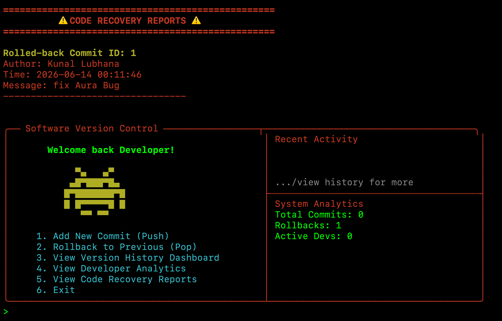

# Custom Version Control System (VCS)

## Project Description
A custom, interactive Version Control System built in C++ that simulates tracking commits, rolling back changes, and providing developer analytics. It features an advanced terminal-based user interface that makes it easy to track developer contributions, view history, and generate code recovery reports.

## Tech Stack
- **Core Application**: C++11
- **Build System**: Makefile
- **Reporting**: Python (`generate_report.py`)

## Features
- **Commit Tracking System**: Add commits with messages and author names.
- **Rollback Engine**: Revert changes and go back to previous states easily.
- **Version History Dashboard**: View a clear history of all commits.
- **Developer Analytics**: Gain insights into developer contributions and activity.
- **Code Recovery Reports**: Generate detailed reports for code recovery.
- **Advanced Terminal UI Dashboard**: An interactive, user-friendly terminal dashboard.

## Architecture Flowchart


## Screenshots
Here are some screenshots demonstrating the application's interface:





## Setup Instructions

### Prerequisites
- `g++` compiler (with C++11 support)
- `make` build utility
- `python3` (for report generation features)

### Installation & Running
1. Clone the repository:
   ```bash
   git clone <your-repository-url>
   cd svc
   ```

2. Build the C++ application using `make`:
   ```bash
   make
   ```

3. Run the application:
   ```bash
   ./vcs_app
   ```

4. To clean the compiled files, you can run:
   ```bash
   make clean
   ```

5. (Optional) Run the report generation script:
   ```bash
   python3 generate_report.py
   ```
